# Architecture

This document explores different architectural patterns for multi-agent systems.

## Table of Contents
1. [Hub-and-Spoke (Current)](#1-hub-and-spoke-star-current)
2. [Pipeline / Sequential](#2-pipeline--sequential)
3. [Peer-to-Peer / Mesh](#3-peer-to-peer--mesh)
4. [Hierarchical / Tree](#4-hierarchical--tree)
5. [Blackboard / Shared Memory](#5-blackboard--shared-memory)
6. [Marketplace / Broker](#6-marketplace--broker)
7. [Event-Driven / Pub-Sub](#7-event-driven--pub-sub)
8. [Hybrid Architectures](#8-hybrid-architectures)
9. [Comparison Matrix](#9-comparison-matrix)

---

## 1. Hub-and-Spoke (Star) - Current

**Current implementation in clean_mcp_a2a**

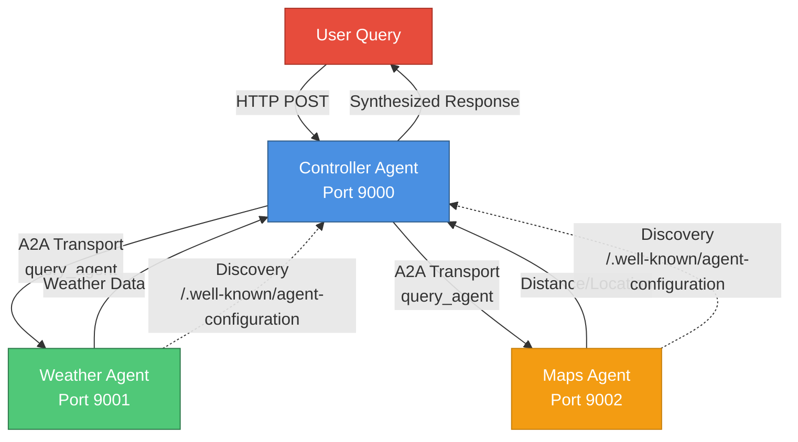

**Characteristics:**
- **Centralized coordination** through Controller Agent
- **Spoke agents** (Weather, Maps) are specialized and isolated
- **Single point of entry** for all user queries
- **Dynamic discovery** via A2A protocol

**Pros:**
- ✅ Simple to understand and implement
- ✅ Easy to add new specialized agents
- ✅ Clear coordination logic in one place
- ✅ Good for heterogeneous tasks

**Cons:**
- ❌ Controller is single point of failure
- ❌ Controller bottleneck for high load
- ❌ Spoke agents can't communicate directly
- ❌ Coordination logic complexity grows with agents

**Best for:**
- Small-medium number of specialized agents (2-10)
- Tasks requiring synthesis of multiple agent outputs
- Systems where coordination logic is complex

---

## 2. Pipeline / Sequential

**Agents process tasks in a defined sequence, each adding value**

```mermaid
graph LR
    User[User Query] -->|Request| Intake[Intake Agent<br/>Parse & Route]

    Intake -->|Structured Query| Weather[Weather Agent<br/>Get Weather]
    Weather -->|Weather Context| Maps[Maps Agent<br/>Calculate Route]
    Maps -->|Route + Weather| Recommend[Recommendation Agent<br/>Suggest Activities]
    Recommend -->|Final Package| Format[Formatting Agent<br/>Create Response]

    Format -->|Response| User

    style Intake fill:#3498db,stroke:#2874a6,color:#fff
    style Weather fill:#50c878,stroke:#2d7a4a,color:#fff
    style Maps fill:#f39c12,stroke:#c87f0a,color:#fff
    style Recommend fill:#9b59b6,stroke:#6c3483,color:#fff
    style Format fill:#e67e22,stroke:#ba4a00,color:#fff
    style User fill:#e74c3c,stroke:#a93226,color:#fff
```

**Data Flow Example:**
```
User: "Plan a trip to Tokyo next week"
  ↓
Intake: {destination: "Tokyo", timeframe: "next week", intent: "travel"}
  ↓
Weather: {temp: 22°C, conditions: "rainy", forecast: [...]}
  ↓
Maps: {distance: 6000km, route: [...], time: 13h}
  ↓
Recommend: {activities: ["indoor museums", "covered markets"], schedule: [...]}
  ↓
Format: "Here's your Tokyo trip plan: [formatted response]"
```

**Pros:**
- ✅ Clear data transformation steps
- ✅ Easy to reason about flow
- ✅ Each agent has single responsibility
- ✅ Easy to debug (inspect between stages)
- ✅ Can parallelize independent pipelines

**Cons:**
- ❌ Rigid ordering - can't skip steps easily
- ❌ Latency accumulates (serial processing)
- ❌ One agent failure breaks entire pipeline
- ❌ Not suited for dynamic/conditional routing

**Best for:**
- Document processing workflows
- ETL (Extract-Transform-Load) tasks
- Tasks with clear sequential dependencies
- Gradual enrichment of data

---

## 3. Peer-to-Peer / Mesh

**Agents communicate directly with each other as needed**

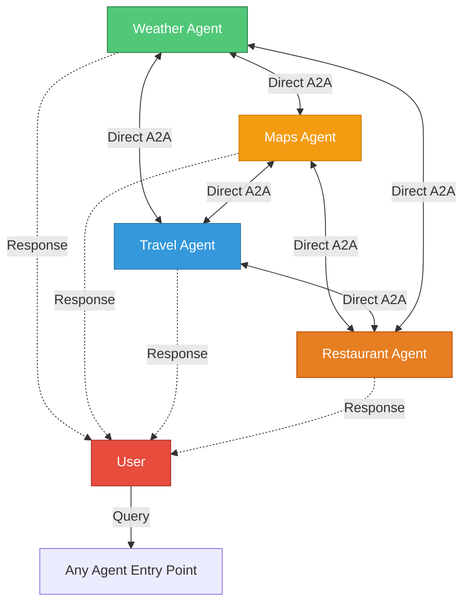

**Communication Pattern:**
```
Weather Agent discovers it needs route info
  → Directly queries Maps Agent
  → Gets route weather conditions
  → Realizes need for restaurant data
  → Queries Restaurant Agent
  → Synthesizes complete response
```

**Pros:**
- ✅ Highly resilient (no single point of failure)
- ✅ Flexible collaboration patterns
- ✅ Agents can optimize local interactions
- ✅ Scales horizontally well
- ✅ Good for distributed systems

**Cons:**
- ❌ Complex to implement and debug
- ❌ Difficult to track request flow
- ❌ Risk of circular dependencies
- ❌ Potential for message storms
- ❌ Harder to ensure consistency

**Best for:**
- Large-scale distributed systems
- High-availability requirements
- Agents with equal capabilities
- Dynamic, unpredictable workloads

---

## 4. Hierarchical / Tree

**Multi-level coordination with specialized coordinators at each level**

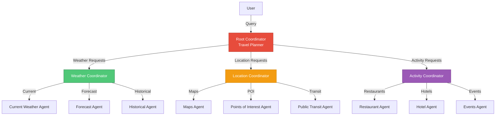

**Delegation Pattern:**
```
User: "Plan weekend in Paris"
  ↓
Root Coordinator:
  ├─ WeatherCoord: "Get Paris weekend weather"
  │   ├─ WeatherCurrent: "Paris current"
  │   └─ WeatherForecast: "Paris Sat-Sun"
  ├─ LocationCoord: "Get Paris attractions"
  │   ├─ POI: "Top attractions"
  │   └─ Transit: "Metro info"
  └─ ActivityCoord: "Weekend activities"
      ├─ Restaurant: "Popular restaurants"
      └─ Events: "Weekend events"
```

**Pros:**
- ✅ Excellent scalability for large systems
- ✅ Clear responsibility boundaries
- ✅ Coordinators can optimize sub-requests
- ✅ Easy to add new leaf agents
- ✅ Good for domain decomposition

**Cons:**
- ❌ More complex than hub-and-spoke
- ❌ Higher latency (multiple coordination levels)
- ❌ Coordinators need domain expertise
- ❌ Can be over-engineered for small systems

**Best for:**
- Large organizations with clear domains
- Systems with 10+ specialized agents
- Tasks with natural hierarchical decomposition
- Enterprise multi-agent systems

---

## 5. Blackboard / Shared Memory

**Agents collaborate via shared knowledge space**

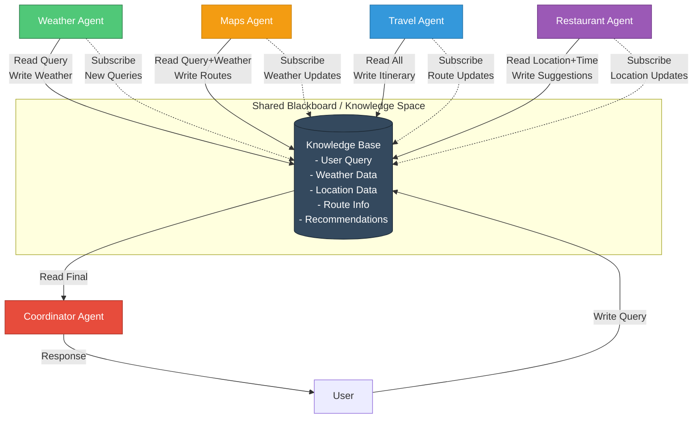

**Operation Flow:**
```
1. User writes query to blackboard
2. Weather Agent notices new query, writes weather data
3. Maps Agent sees query + weather, writes route options
4. Restaurant Agent sees location, writes dining suggestions
5. Travel Agent sees all data, writes complete itinerary
6. Coordinator reads final state, returns to user
```

**Pros:**
- ✅ Agents loosely coupled
- ✅ Asynchronous collaboration
- ✅ Easy to add new agents (just subscribe)
- ✅ Natural for incremental problem solving
- ✅ Good for complex, evolving problems

**Cons:**
- ❌ Requires robust shared state management
- ❌ Coordination complexity in blackboard logic
- ❌ Race conditions possible
- ❌ Harder to reason about causality
- ❌ Debugging distributed state is difficult

**Best for:**
- Complex problem-solving (planning, design)
- Opportunistic agent collaboration
- Systems where solution emerges incrementally
- Research/experimental multi-agent systems

---

## 6. Marketplace / Broker

**Dynamic agent selection based on capabilities and bidding**

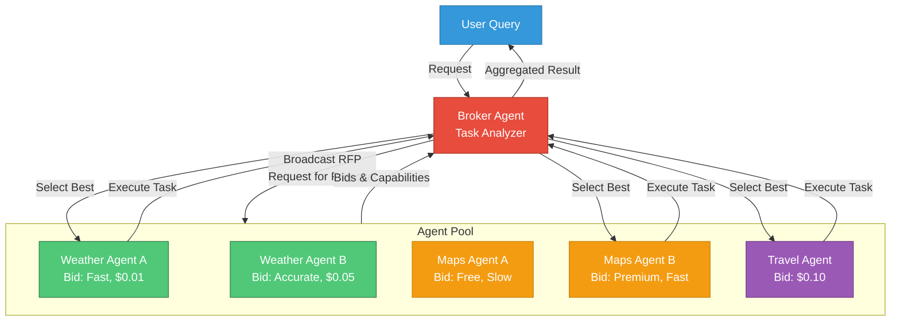

**Bidding Process:**
```
User Query: "Get weather and route to Paris, fast please"

Broker analyzes:
  - Need: Weather data (priority: speed)
  - Need: Route calculation (priority: speed)

Broadcasts RFP:
  {
    task: "weather_paris",
    constraints: {speed: "high", cost: "medium"},
    deadline: "2s"
  }

Agents bid:
  - Weather A: "2s, $0.01, accuracy 90%"
  - Weather B: "5s, $0.05, accuracy 99%"

Broker selects: Weather A (meets speed requirement)
```

**Pros:**
- ✅ Dynamic optimization (cost, speed, quality)
- ✅ Excellent for heterogeneous agents
- ✅ Fault tolerance (alternative providers)
- ✅ Resource-aware scheduling
- ✅ Market-based load balancing

**Cons:**
- ❌ Complex bidding protocol
- ❌ Overhead of agent discovery and bidding
- ❌ Requires agent capability descriptions
- ❌ May select suboptimal combinations
- ❌ Gaming concerns if real economics

**Best for:**
- Cloud agent marketplaces
- Systems with SLA requirements
- Resource-constrained environments
- Multi-tenant agent platforms

---

## 7. Event-Driven / Pub-Sub

**Agents react to events published to topics/channels**

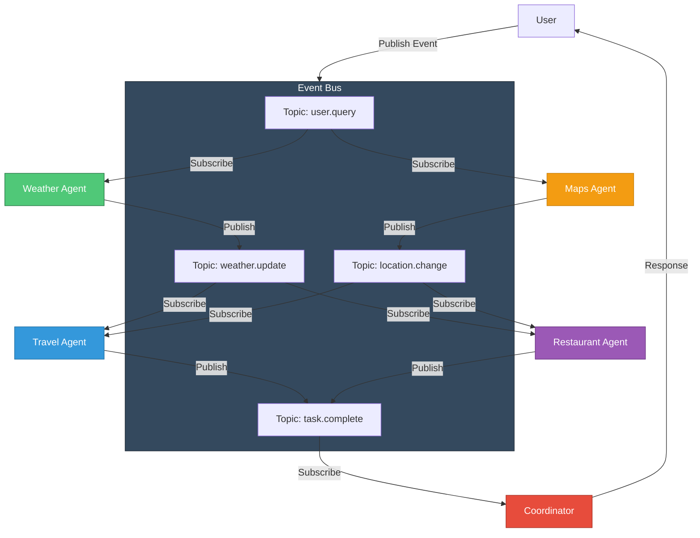

**Event Flow:**
```
1. User publishes: user.query {"q": "Trip to Paris"}

2. Weather Agent (subscribed to user.query):
   - Processes query
   - Publishes: weather.update {"paris": "sunny, 22°C"}

3. Maps Agent (subscribed to user.query):
   - Processes query
   - Publishes: location.change {"dest": "Paris", "coords": [48.8, 2.3]}

4. Travel Agent (subscribed to weather.update + location.change):
   - Waits for both events
   - Computes itinerary
   - Publishes: task.complete {"itinerary": [...]}

5. Coordinator (subscribed to task.complete):
   - Aggregates results
   - Sends response to user
```

**Pros:**
- ✅ Highly decoupled agents
- ✅ Excellent scalability
- ✅ Easy to add/remove agents
- ✅ Natural for real-time systems
- ✅ Event replay for debugging
- ✅ Temporal decoupling (async)

**Cons:**
- ❌ Requires message broker infrastructure
- ❌ Harder to track request flow
- ❌ Event ordering challenges
- ❌ Eventual consistency issues
- ❌ Complex error handling

**Best for:**
- Real-time monitoring systems
- High-throughput systems
- Microservices architectures
- Systems requiring audit trails
- IoT and streaming data

---

## 8. Hybrid Architectures

### 8.1 Hub-and-Spoke + Pipeline

**Coordinator dispatches to specialized pipelines**

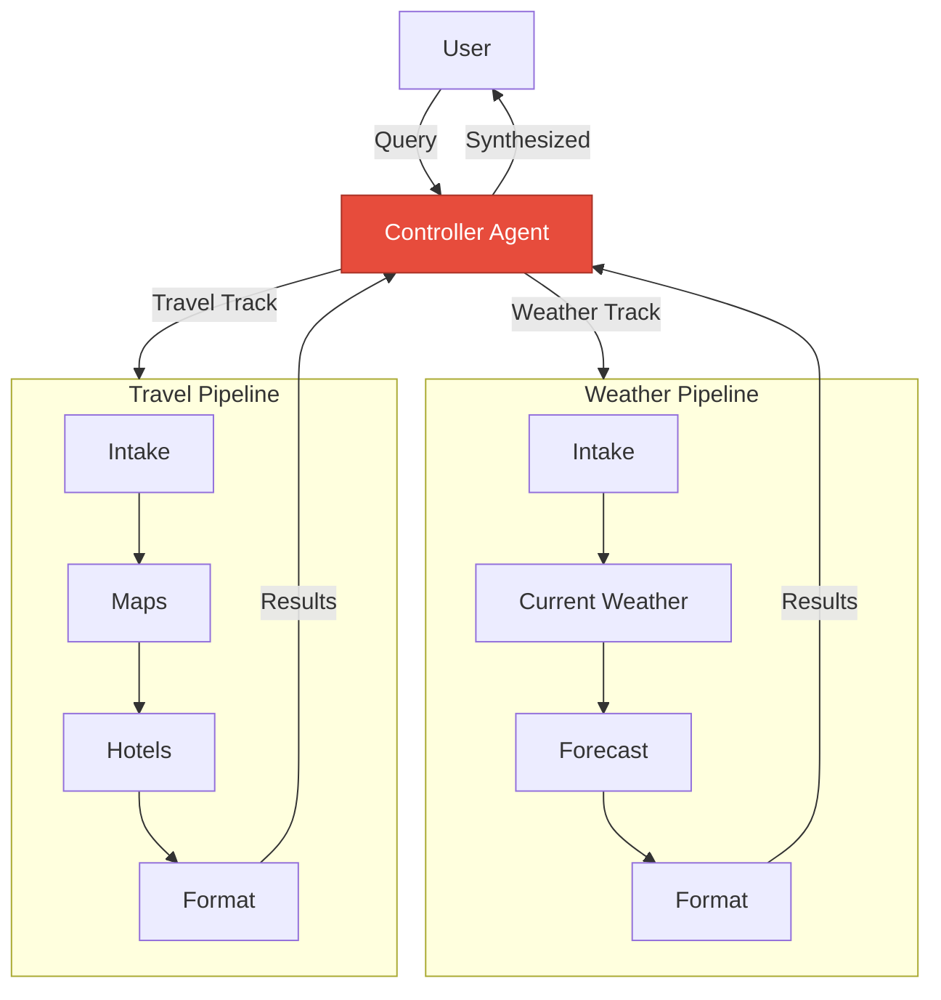

**Use Case:** Complex queries requiring both coordinated parallel work AND sequential processing.

### 8.2 Hierarchical + Marketplace

**Coordinators use marketplaces to select optimal sub-agents**

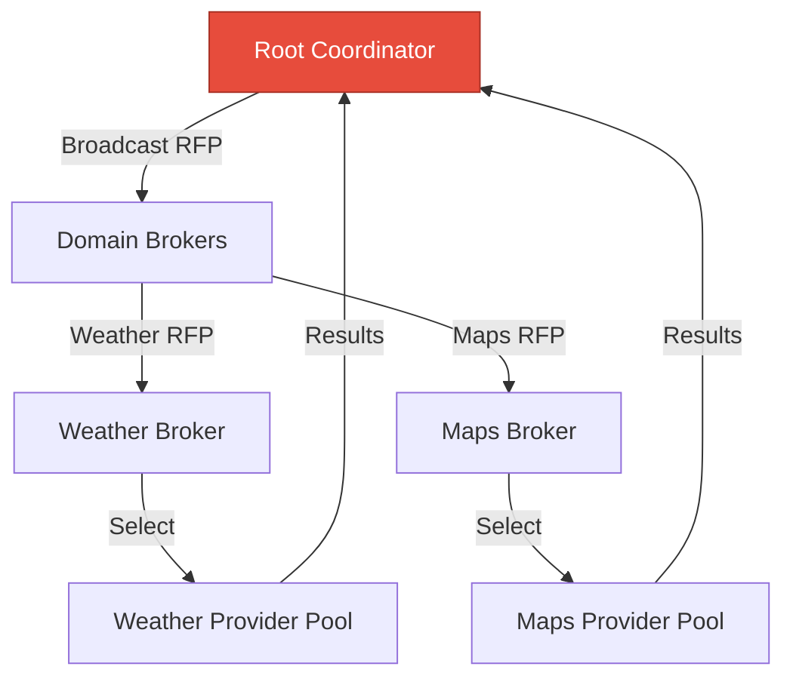

**Use Case:** Large-scale systems with SLAs and heterogeneous agent providers.

### 8.3 Event-Driven + Blackboard

**Events trigger agents to read/write shared knowledge**

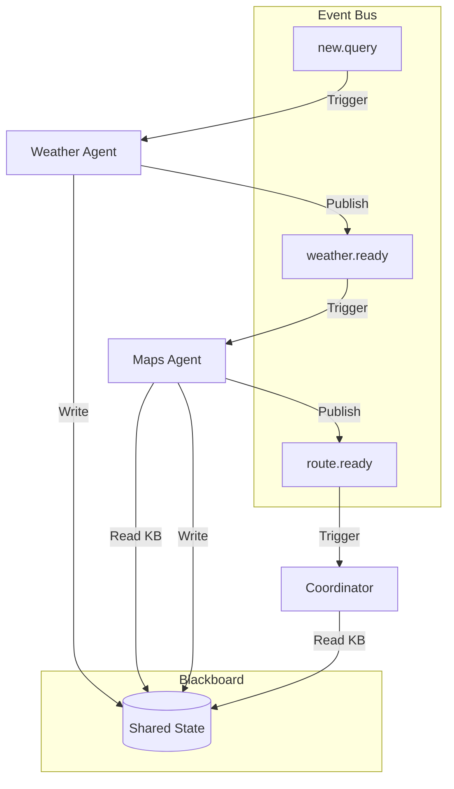

**Use Case:** Complex problem-solving with both reactive behavior and shared state.

---

## 9. Comparison Matrix

| Architecture | Complexity | Scalability | Fault Tolerance | Latency | Best Use Case |
|-------------|-----------|-------------|-----------------|---------|---------------|
| **Hub-and-Spoke** | ⭐⭐ Low | ⭐⭐⭐ Medium | ⭐⭐ Low | ⭐⭐⭐⭐ Good | Small systems, clear coordination |
| **Pipeline** | ⭐⭐ Low | ⭐⭐⭐ Medium | ⭐⭐ Low | ⭐⭐⭐ Medium | Sequential workflows, ETL |
| **Peer-to-Peer** | ⭐⭐⭐⭐⭐ Very High | ⭐⭐⭐⭐⭐ Excellent | ⭐⭐⭐⭐⭐ Excellent | ⭐⭐⭐⭐ Good | Large distributed systems |
| **Hierarchical** | ⭐⭐⭐⭐ High | ⭐⭐⭐⭐⭐ Excellent | ⭐⭐⭐ Medium | ⭐⭐⭐ Medium | Large organizations, domains |
| **Blackboard** | ⭐⭐⭐⭐ High | ⭐⭐⭐ Medium | ⭐⭐⭐ Medium | ⭐⭐⭐ Medium | Complex problem-solving |
| **Marketplace** | ⭐⭐⭐⭐⭐ Very High | ⭐⭐⭐⭐ Good | ⭐⭐⭐⭐ Good | ⭐⭐ Variable | Cloud platforms, SLAs |
| **Event-Driven** | ⭐⭐⭐⭐ High | ⭐⭐⭐⭐⭐ Excellent | ⭐⭐⭐⭐ Good | ⭐⭐⭐⭐ Good | Real-time, high throughput |

### Key Metrics Explained:

- **Complexity**: Implementation and maintenance difficulty
- **Scalability**: Ability to handle more agents/load
- **Fault Tolerance**: Resilience to agent failures
- **Latency**: Typical response time characteristics
- **Best Use Case**: Primary recommended scenarios

---

## 10. Recommendations

### Current state

The default **Hub-and-Spoke** architecture works well for:
- Small number of specialized agents (2-5)
- Coordinated multi-agent queries
- Clear separation of concerns

### Evolution path

#### Short-term (Keep Hub-and-Spoke)
**When:**
- System has < 10 agents
- Coordination logic is manageable
- Performance is acceptable

**Enhancements:**
```python
# Add health checking
# Add agent registry caching
# Implement timeout handling
# Add circuit breakers
```

#### Mid-term (Hybrid: Hub-and-Spoke + Pipeline)
**When:**
- Adding domain-specific workflows (booking, planning)
- Need better composition of agent results
- Want to reduce Controller complexity

**Example:**
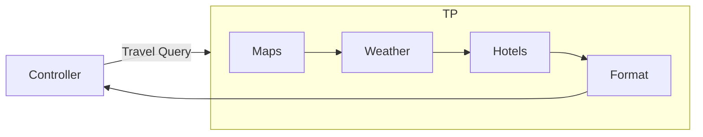

#### Long-term (Event-Driven or Hierarchical)
**When:**
- System has > 10 agents
- Need real-time capabilities
- Scalability becomes critical

**Migration:**
1. Add event bus (Redis Pub/Sub, RabbitMQ)
2. Wrap existing agents with event adapters
3. Gradually migrate coordination logic to event handlers

---

## 11. Implementation Considerations

### SDK support
```python
# Your SDK supports all these patterns via:

# 1. Hub-and-Spoke (current)
controller.connected_agents = [agent1_url, agent2_url]

# 2. Pipeline
agent1 → agent2 → agent3  # Chain via connected_agents

# 3. Peer-to-Peer
# All agents have a2a_transport, can query each other

# 4. Event-Driven
# Add event bus MCP server to all agents
# Agents publish/subscribe via tools
```

### Adding Event-Driven Support
```python
# Create event bus MCP server
@tool(name="publish_event")
async def publish_event(args: dict):
    topic = args["topic"]
    event = args["event"]
    await event_bus.publish(topic, event)

@tool(name="subscribe_to_topic")
async def subscribe_to_topic(args: dict):
    topic = args["topic"]
    # Return recent events or set up listener
    return await event_bus.get_recent(topic)

# Add to agents
class EventDrivenAgent(BaseA2AAgent):
    def __init__(self):
        super().__init__(
            sdk_mcp_server=create_event_bus_server()
        )
```

---

## Conclusion

Each architecture has trade-offs. The current **Hub-and-Spoke** is excellent for your current scale. Consider evolution based on:

1. **Number of agents**: > 10 → Consider Hierarchical
2. **Real-time needs**: → Event-Driven
3. **Complex workflows**: → Pipeline or Hybrid
4. **Fault tolerance critical**: → Peer-to-Peer or Event-Driven
5. **Resource optimization**: → Marketplace

Start simple, evolve as needs change.
