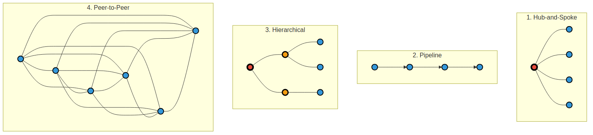

# Multi-Agent Architecture Patterns



## The 4 Main Patterns

### 1. Hub-and-Spoke ⭐ (Your Current System)
- **Red center node** = Controller
- **Blue nodes** = Agents
- All communication through central controller
- **Use when:** 2-10 agents, simple coordination needs

### 2. Pipeline
- **Arrows** show sequential data flow
- Each agent processes and passes to next
- **Use when:** Workflows, ETL, step-by-step processing

### 3. Hierarchical
- **3 levels:** Red (root) → Orange (coordinators) → Blue (agents)
- Tree structure with domain separation
- **Use when:** 10+ agents, clear organizational domains

### 4. Peer-to-Peer
- **Spider web:** Every agent connects to every other
- No central controller, fully distributed
- **Use when:** High availability critical, distributed systems

---

## Visual Legend

- 🔴 **Red (thick border)** = Root controller
- 🟠 **Orange (medium border)** = Domain coordinators
- 🔵 **Blue** = Agents
- **Solid lines** = Connections
- **Arrows** = Directional flow

---

## Quick Selection

```
2-10 agents, simple          → Hub-and-Spoke ✅ (Current)
Sequential workflow          → Pipeline
10+ agents, domains          → Hierarchical
Distributed, resilient       → Peer-to-Peer
```
