# Multi-Agent Architecture Patterns - Visual Comparison

Complete visual reference of all major multi-agent architecture patterns.

---

## All Patterns Side-by-Side

```mermaid
graph TB
    subgraph Pattern1 [1. Hub-and-Spoke / Star]
        U1[User] --> C1[Coordinator]
        C1 --> A1[Agent 1]
        C1 --> A2[Agent 2]
        C1 --> A3[Agent 3]
        A1 --> C1
        A2 --> C1
        A3 --> C1
        C1 --> U1
    end

    subgraph Pattern2 [2. Pipeline / Sequential]
        U2[User] --> P1[Agent 1]
        P1 --> P2[Agent 2]
        P2 --> P3[Agent 3]
        P3 --> P4[Agent 4]
        P4 --> U2
    end

    subgraph Pattern3 [3. Peer-to-Peer / Mesh]
        U3[User] --> M1[Agent 1]
        M1 <--> M2[Agent 2]
        M1 <--> M3[Agent 3]
        M1 <--> M4[Agent 4]
        M2 <--> M3
        M2 <--> M4
        M3 <--> M4
        M1 -.-> U3
        M2 -.-> U3
        M3 -.-> U3
        M4 -.-> U3
    end

    subgraph Pattern4 [4. Hierarchical / Tree]
        U4[User] --> Root[Root]
        Root --> C4a[Coord A]
        Root --> C4b[Coord B]
        C4a --> L1[Agent 1]
        C4a --> L2[Agent 2]
        C4b --> L3[Agent 3]
        C4b --> L4[Agent 4]
        L1 --> C4a
        L2 --> C4a
        L3 --> C4b
        L4 --> C4b
        C4a --> Root
        C4b --> Root
        Root --> U4
    end

    subgraph Pattern5 [5. Blackboard / Shared Memory]
        U5[User] --> BB[(Blackboard)]
        BB --> B1[Agent 1]
        BB --> B2[Agent 2]
        BB --> B3[Agent 3]
        BB --> B4[Agent 4]
        B1 --> BB
        B2 --> BB
        B3 --> BB
        B4 --> BB
        BB --> Coord5[Coordinator]
        Coord5 --> U5
    end

    subgraph Pattern6 [6. Marketplace / Broker]
        U6[User] --> Broker[Broker]
        Broker <--> Pool6[Agent Pool]
        Pool6 --> MK1[Agent 1]
        Pool6 --> MK2[Agent 2]
        Pool6 --> MK3[Agent 3]
        Pool6 --> MK4[Agent 4]
        MK1 --> Pool6
        MK2 --> Pool6
        MK3 --> Pool6
        MK4 --> Pool6
        Pool6 --> Broker
        Broker --> U6
    end

    subgraph Pattern7 [7. Event-Driven / Pub-Sub]
        U7[User] --> Bus[(Event Bus)]
        Bus --> E1[Agent 1]
        Bus --> E2[Agent 2]
        Bus --> E3[Agent 3]
        Bus --> E4[Agent 4]
        E1 --> Bus
        E2 --> Bus
        E3 --> Bus
        E4 --> Bus
        Bus --> Coord7[Coordinator]
        Coord7 --> U7
    end

    style C1 fill:#e74c3c,stroke:#a93226,color:#fff
    style Root fill:#e74c3c,stroke:#a93226,color:#fff
    style Broker fill:#e74c3c,stroke:#a93226,color:#fff
    style Coord5 fill:#e74c3c,stroke:#a93226,color:#fff
    style Coord7 fill:#e74c3c,stroke:#a93226,color:#fff
    style BB fill:#34495e,stroke:#1c2833,color:#fff
    style Bus fill:#34495e,stroke:#1c2833,color:#fff
    style Pool6 fill:#95a5a6,stroke:#7f8c8d,color:#fff
```

---

## Pattern Characteristics Summary

| Pattern | Communication | Coordination | Coupling | Scalability |
|---------|--------------|--------------|----------|-------------|
| **1. Hub-and-Spoke** | Centralized | Single coordinator | Tight | Medium |
| **2. Pipeline** | Sequential | Implicit ordering | Tight | Medium |
| **3. Peer-to-Peer** | Distributed | Negotiated | Loose | High |
| **4. Hierarchical** | Tree-based | Multi-level | Medium | High |
| **5. Blackboard** | Shared state | Opportunistic | Loose | Medium |
| **6. Marketplace** | Brokered | Dynamic selection | Loose | High |
| **7. Event-Driven** | Pub/Sub | Event triggers | Very Loose | Very High |

---

## Detailed Individual Patterns

### 1. Hub-and-Spoke (Star)

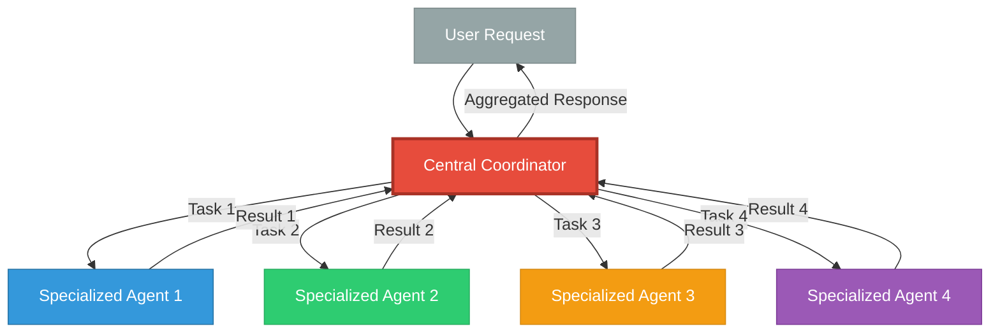

**Flow:** User → Coordinator → Agents (parallel) → Coordinator → User

---

### 2. Pipeline / Sequential

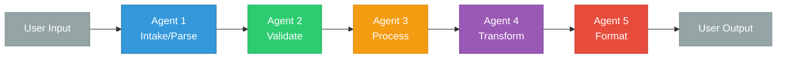

**Flow:** User → Agent 1 → Agent 2 → Agent 3 → Agent 4 → Agent 5 → User

---

### 3. Peer-to-Peer / Mesh

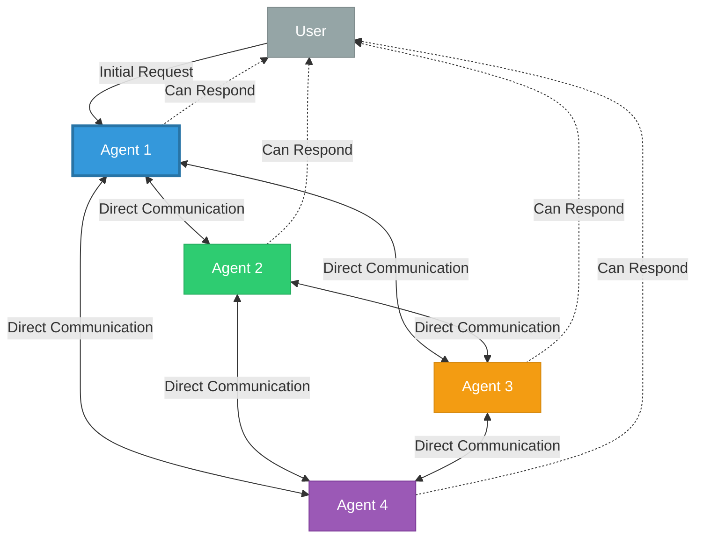

**Flow:** User → Any Agent → Agents collaborate directly → Response from any Agent

---

### 4. Hierarchical / Tree

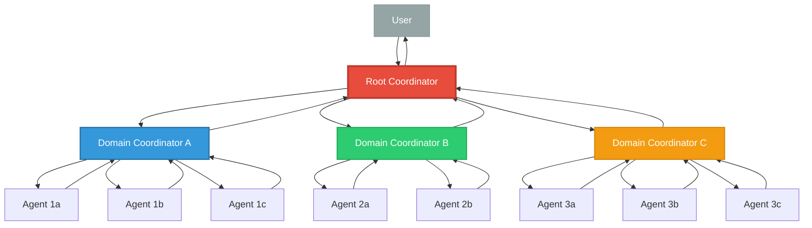

**Flow:** User → Root → Domain Coordinators → Leaf Agents → Domain Coordinators → Root → User

---

### 5. Blackboard / Shared Memory

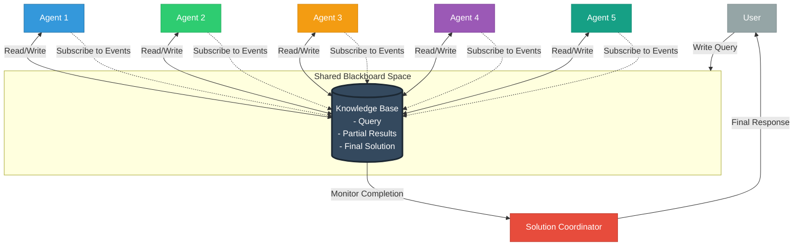

**Flow:** User → Blackboard ← Agents (async read/write) → Coordinator monitors → User

---

### 6. Marketplace / Broker

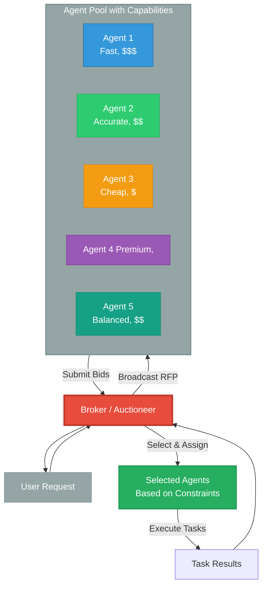

**Flow:** User → Broker → RFP Broadcast → Agents Bid → Broker Selects → Task Execution → User

---

### 7. Event-Driven / Pub-Sub

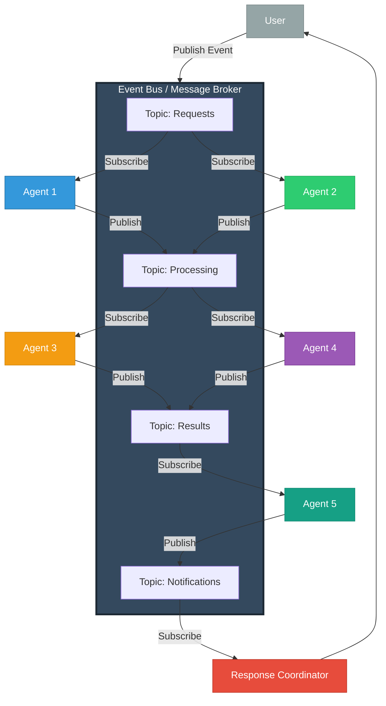

**Flow:** User → Event Bus → Agents subscribe to topics → Publish new events → Cascading reactions → Coordinator → User

---

## Selection Decision Tree

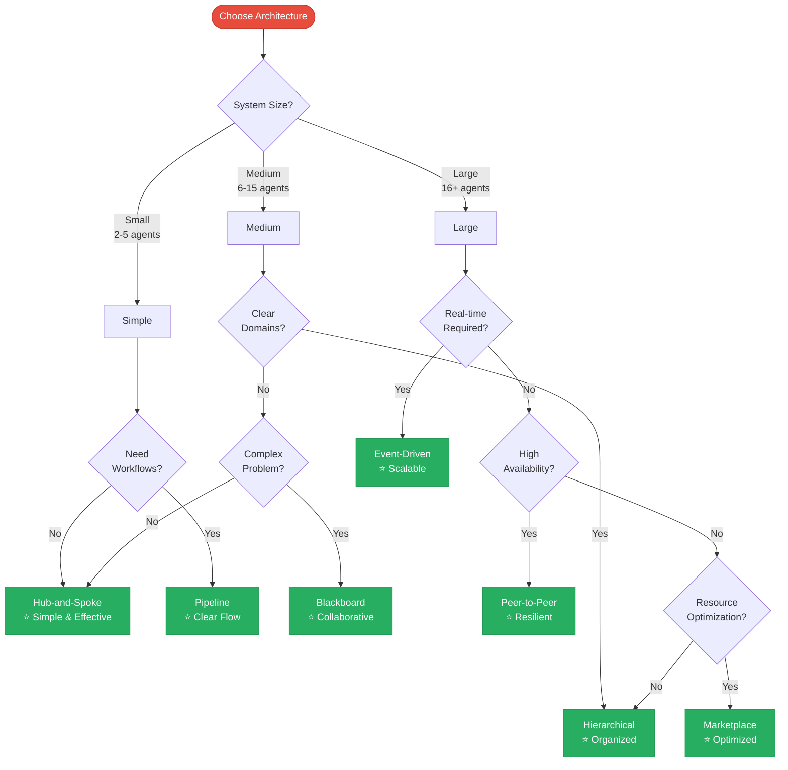

---

## Pattern Complexity vs Scalability

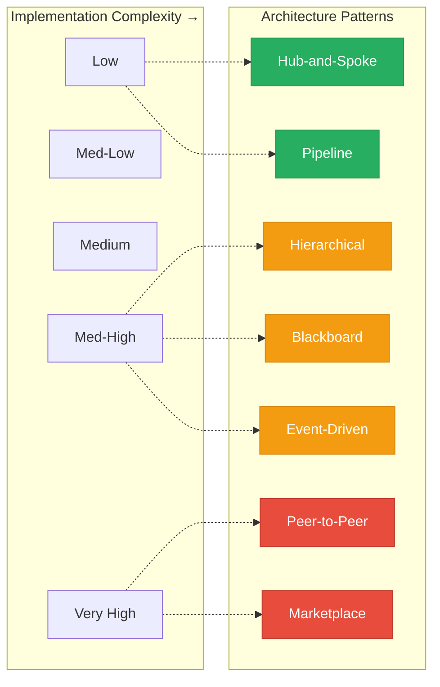

**Legend:**
- 🟢 Green: Low complexity, good starting point
- 🟠 Orange: Medium complexity, scales well
- 🔴 Red: High complexity, maximum scalability

---

## Communication Patterns

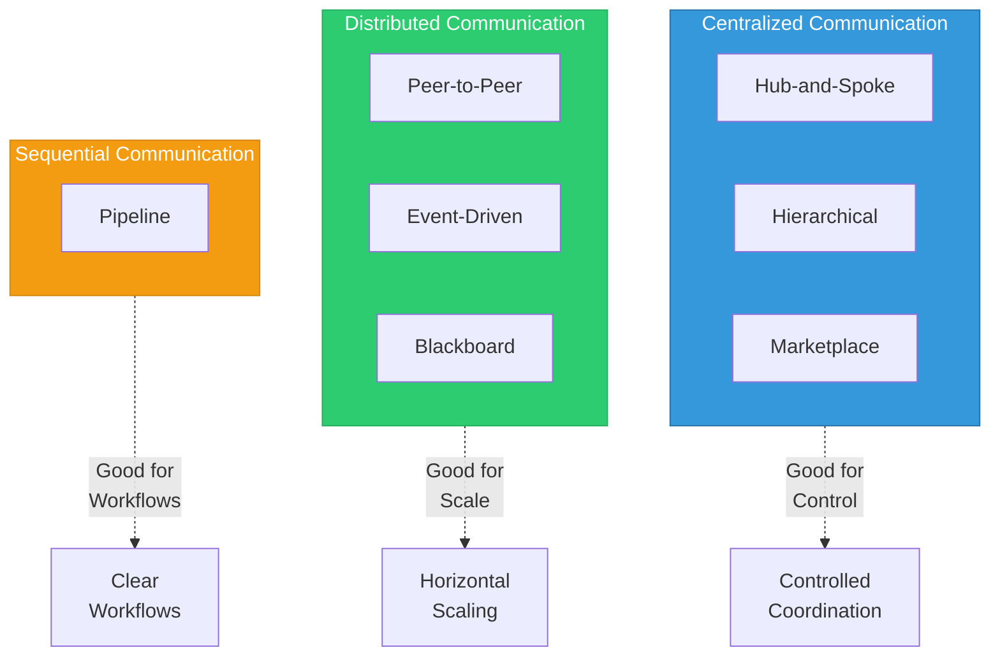

---

## Use Case Mapping

| Use Case | Recommended Pattern | Why |
|----------|-------------------|-----|
| **Small team coordination** | Hub-and-Spoke | Simple, clear control |
| **Document processing** | Pipeline | Sequential transformation |
| **Enterprise multi-domain** | Hierarchical | Domain separation |
| **Research/AI planning** | Blackboard | Opportunistic collaboration |
| **IoT/Real-time monitoring** | Event-Driven | Asynchronous, scalable |
| **Distributed services** | Peer-to-Peer | High availability |
| **Cloud agent platform** | Marketplace | Resource optimization |

---

## Quick Reference Card

### When to Use Each Pattern

**Hub-and-Spoke:**
- ✅ 2-10 agents
- ✅ Clear coordination needed
- ✅ Simple to implement
- ❌ Single point of failure

**Pipeline:**
- ✅ Sequential dependencies
- ✅ Data transformation
- ✅ Easy to debug
- ❌ Serial latency

**Peer-to-Peer:**
- ✅ High availability critical
- ✅ Large scale (10+ agents)
- ✅ Dynamic collaboration
- ❌ Complex debugging

**Hierarchical:**
- ✅ Clear domains
- ✅ 10+ agents
- ✅ Scalable structure
- ❌ Multi-hop latency

**Blackboard:**
- ✅ Complex problems
- ✅ Incremental solving
- ✅ Opportunistic agents
- ❌ State management

**Marketplace:**
- ✅ Resource optimization
- ✅ SLA requirements
- ✅ Heterogeneous agents
- ❌ Bidding overhead

**Event-Driven:**
- ✅ Real-time needs
- ✅ High throughput
- ✅ Loose coupling
- ❌ Infrastructure needed
