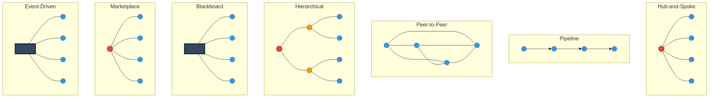

# Multi-Agent Architecture Patterns - Simple Visual Guide

Clean, minimal comparison of all 7 multi-agent architecture patterns in a single image.

---

## All Patterns at a Glance



**Visual Legend:**
- 🔴 Red nodes = Coordinators/Controllers
- 🟠 Orange nodes = Domain coordinators (Hierarchical)
- 🔵 Blue nodes = Agents
- ⚫ Dark boxes = Infrastructure (Blackboard, Event Bus)

---

## Pattern Summary

### 1. Hub-and-Spoke
- Central coordinator (red) connects to all agents (blue)
- Simple, clear control
- Best for: 2-10 agents

### 2. Pipeline
- Sequential flow through agents
- Clear data transformation
- Best for: Workflows, ETL

### 3. Peer-to-Peer
- All agents connect to each other
- Highly resilient
- Best for: Distributed systems

### 4. Hierarchical
- Multi-level coordination (red → orange → blue)
- Domain separation
- Best for: 10+ agents, clear domains

### 5. Blackboard
- Shared knowledge space (dark box)
- Agents collaborate via shared state
- Best for: Complex problem-solving

### 6. Marketplace
- Broker selects agents dynamically
- Resource optimization
- Best for: Cloud platforms, SLAs

### 7. Event-Driven
- Message bus (dark box) coordinates via events
- Highly scalable
- Best for: Real-time, high throughput

---

## Quick Selection Guide

```
2-5 agents, simple needs        → Hub-and-Spoke ⭐
Sequential workflow needed      → Pipeline
10+ agents, clear domains       → Hierarchical
High availability critical      → Peer-to-Peer
Complex problem solving         → Blackboard
Resource optimization needed    → Marketplace
Real-time / high throughput     → Event-Driven
```

---

## Your Current System

**Pattern:** Hub-and-Spoke ✅

**Why it works:**
- You have 2-3 specialized agents (Weather, Maps)
- Clear coordination needs
- Simple to understand and maintain

**When to evolve:**
- More than 5-10 agents → Consider Hierarchical
- Need real-time → Consider Event-Driven
- Need workflows → Add Pipeline elements

---

## Color Code

- **🔴 Red (thick border):** Primary coordinator/broker
- **🟠 Orange (medium border):** Secondary coordinators
- **🔵 Blue:** Regular agents
- **⚫ Dark:** Shared infrastructure (databases, buses)

---

## Files

- `patterns_minimal.png` - Ultra-clean version (no labels)
- `architecture_patterns_simple.png` - With minimal labels (A, C, etc.)

Both available in `docs/images/`
