# Multi-Agent Architecture Quick Reference

Visual guide to multi-agent system patterns with mermaid diagrams.

---

## 1. Hub-and-Spoke (Current System)

**Pattern:** Central coordinator dispatches to specialized agents

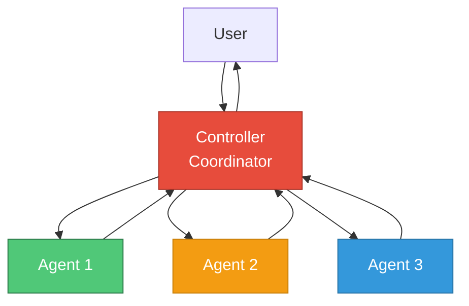

**Pros:** Simple, clear coordination | **Cons:** Single point of failure, bottleneck

---

## 2. Pipeline / Sequential

**Pattern:** Agents process in sequence, each adding value

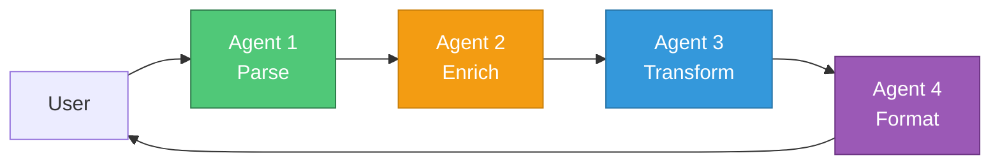

**Pros:** Clear flow, easy debugging | **Cons:** Serial latency, rigid ordering

---

## 3. Peer-to-Peer / Mesh

**Pattern:** Agents communicate directly with each other

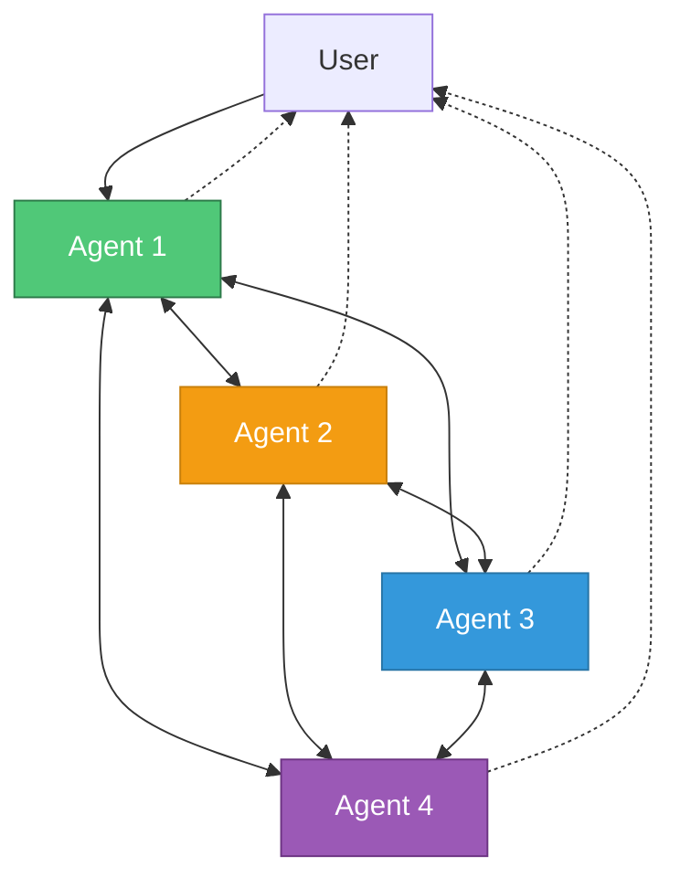

**Pros:** Resilient, flexible | **Cons:** Complex, hard to debug

---

## 4. Hierarchical / Tree

**Pattern:** Multi-level coordination with domain coordinators

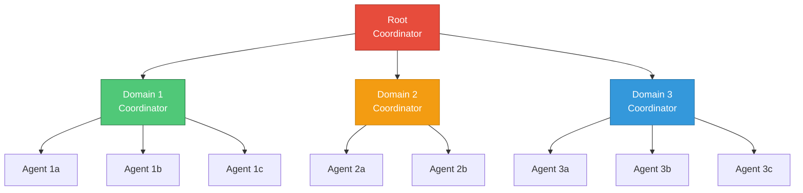

**Pros:** Scales well, clear domains | **Cons:** Higher latency, complex setup

---

## 5. Blackboard / Shared Memory

**Pattern:** Agents collaborate via shared knowledge space

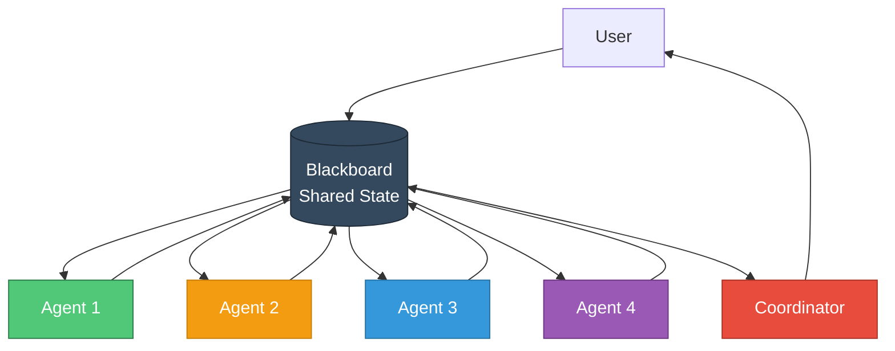

**Pros:** Loose coupling, incremental solving | **Cons:** State management complexity

---

## 6. Marketplace / Broker

**Pattern:** Dynamic agent selection via bidding/negotiation

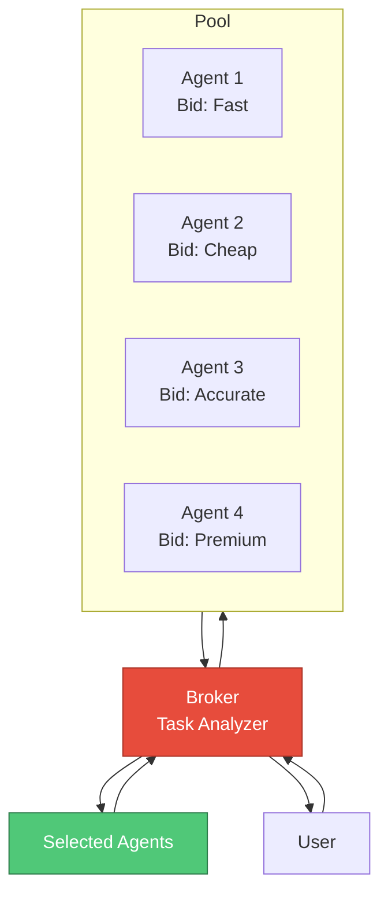

**Pros:** Resource optimization, fault tolerance | **Cons:** Bidding overhead

---

## 7. Event-Driven / Pub-Sub

**Pattern:** Agents react to events via message bus

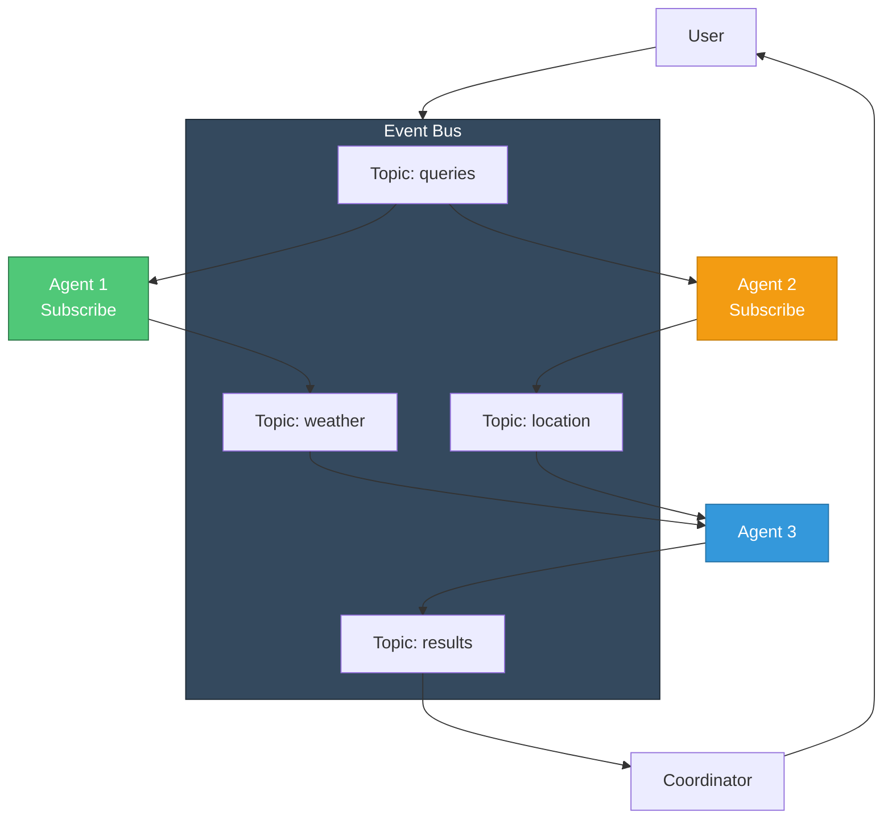

**Pros:** Highly scalable, decoupled | **Cons:** Requires infrastructure, complex flow

---

## 8. Hybrid: Hub + Pipeline

**Pattern:** Coordinator dispatches to specialized pipelines

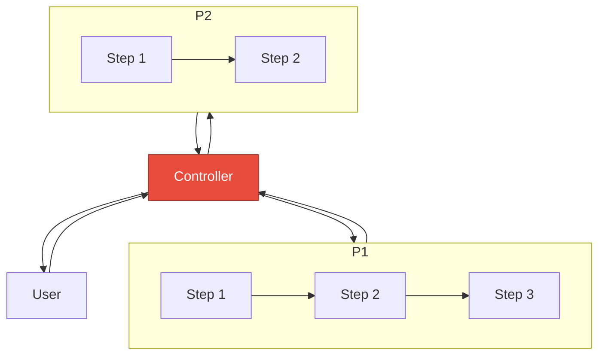

**Pros:** Combines coordination + workflows | **Cons:** More complex

---

## 9. Hybrid: Hierarchical + Marketplace

**Pattern:** Domain coordinators use marketplaces for agent selection

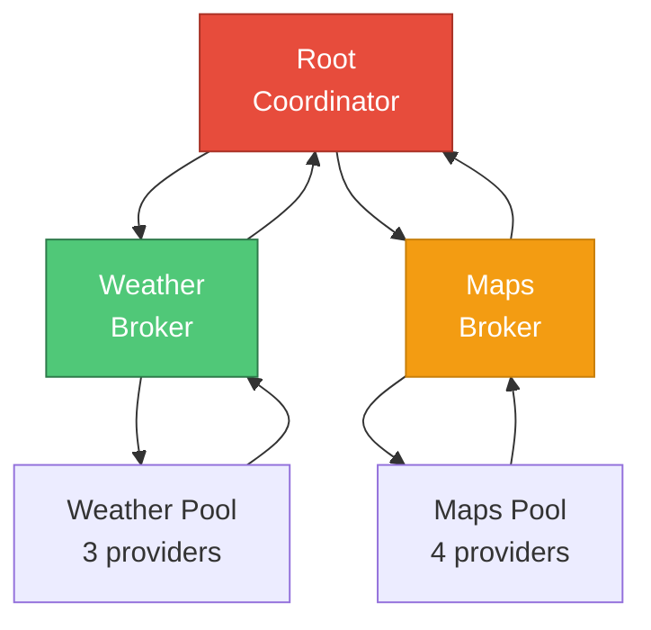

**Pros:** Scalable + optimized | **Cons:** Very complex

---

## Architecture Selection Guide

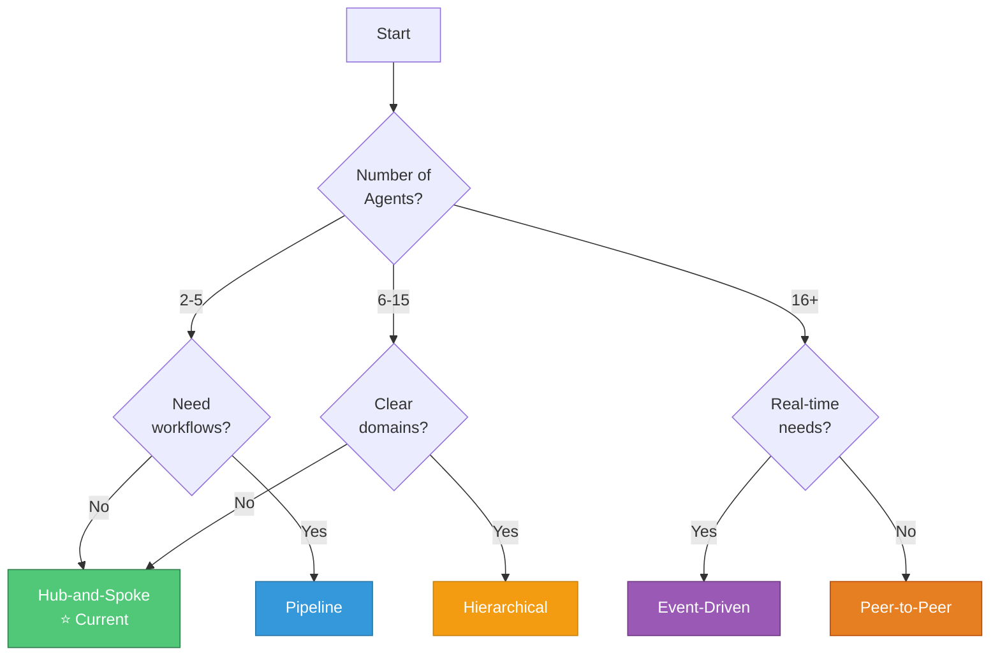

---

## Current System (clean_mcp_a2a)

**Architecture:** Hub-and-Spoke ✅

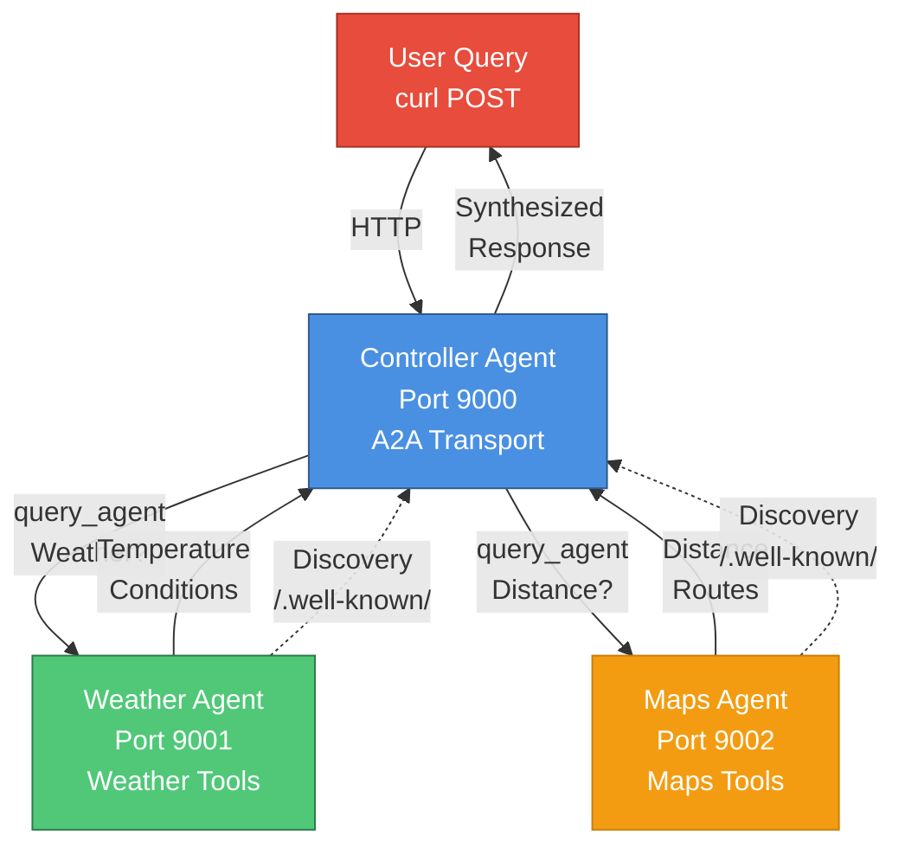

**Key Components:**
- `BaseA2AAgent` - Base class for all agents
- `A2ATransport` - SDK MCP tools for agent communication
- `AgentRegistry` - Dynamic agent discovery
- HTTP endpoints - A2A protocol (query, discovery)

**Tools:**
- Controller: `mcp__a2a_transport__query_agent`, `mcp__a2a_transport__discover_agent`
- Weather: `mcp__weather_agent__get_weather`, `mcp__weather_agent__get_forecast`
- Maps: `mcp__maps_agent__get_distance`, `mcp__maps_agent__get_route`

---

## Migration Paths

### From Hub-and-Spoke to Pipeline

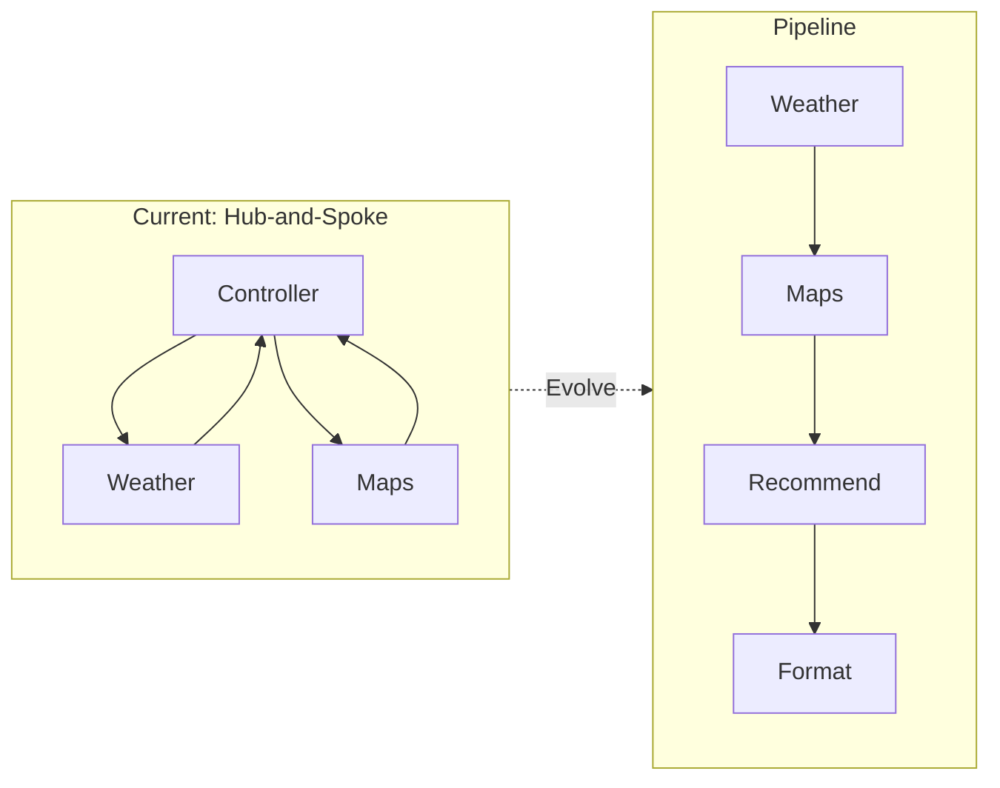

### From Hub-and-Spoke to Event-Driven

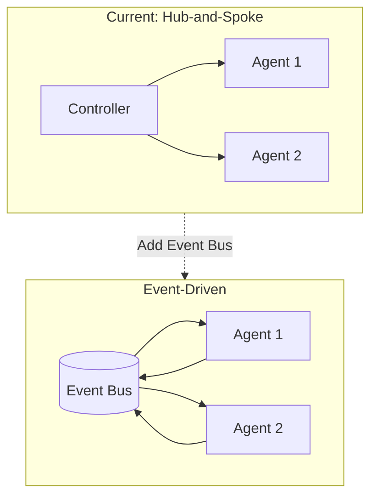

---

## Quick Comparison

| Architecture | Agents | Complexity | Use When |
|-------------|--------|-----------|----------|
| Hub-and-Spoke | 2-10 | ⭐⭐ | **Current** - Simple coordination |
| Pipeline | 3-8 | ⭐⭐ | Sequential workflows needed |
| Peer-to-Peer | 5+ | ⭐⭐⭐⭐⭐ | Distributed, high availability |
| Hierarchical | 10+ | ⭐⭐⭐⭐ | Clear domain boundaries |
| Blackboard | Any | ⭐⭐⭐⭐ | Complex problem-solving |
| Marketplace | Any | ⭐⭐⭐⭐⭐ | Resource optimization, SLAs |
| Event-Driven | 5+ | ⭐⭐⭐⭐ | Real-time, high throughput |

**Current Recommendation:** ✅ Hub-and-Spoke is perfect for your current scale (2-5 agents)
