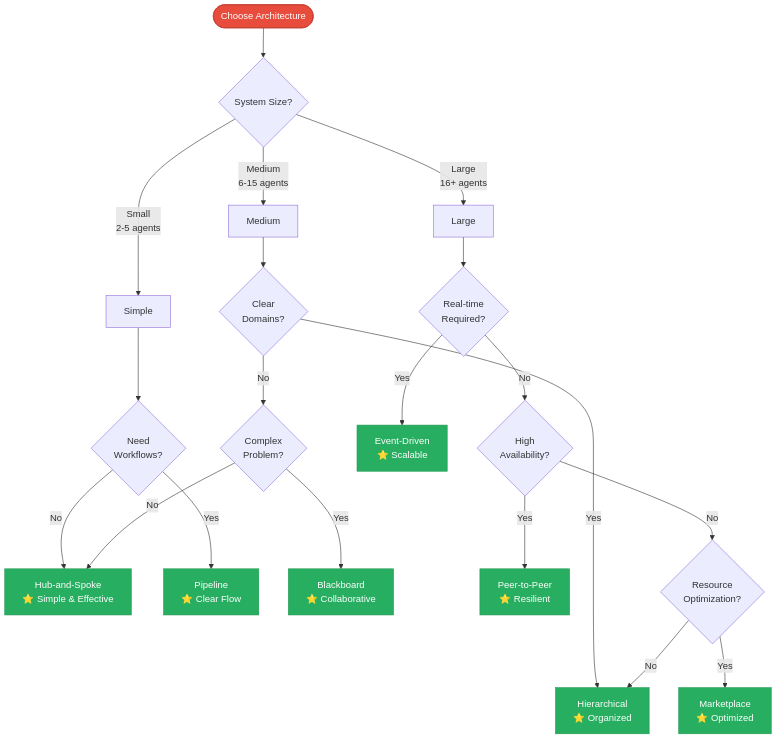

# Multi-Agent Architecture Patterns - Visual Index

High-quality rendered diagrams of all multi-agent architecture patterns.

---

## 1. Hub-and-Spoke (Star) Pattern

**Current implementation in clean_mcp_a2a**

Central coordinator dispatches tasks to specialized agents and aggregates results.


**Characteristics:**
- ✅ Simple, clear coordination
- ✅ Easy to understand and implement
- ❌ Single point of failure
- ❌ Coordinator bottleneck

**Best for:** 2-10 specialized agents, clear coordination needs

---

## 2. Pipeline (Sequential) Pattern

Agents process tasks in sequence, each adding value to the output.


**Characteristics:**
- ✅ Clear data flow
- ✅ Easy debugging
- ❌ Serial latency
- ❌ Rigid ordering

**Best for:** Workflows, ETL, document processing

---

## 3. Peer-to-Peer (Mesh) Pattern

Agents communicate directly with each other as needed.


**Characteristics:**
- ✅ Highly resilient
- ✅ Flexible collaboration
- ❌ Complex to debug
- ❌ Risk of circular dependencies

**Best for:** Distributed systems, high availability

---

## 4. Hierarchical (Tree) Pattern

Multi-level coordination with specialized domain coordinators.


**Characteristics:**
- ✅ Excellent scalability
- ✅ Clear domain boundaries
- ❌ Multi-hop latency
- ❌ More complex setup

**Best for:** Large organizations, 10+ agents, clear domains

---

## 5. Blackboard (Shared Memory) Pattern

Agents collaborate via shared knowledge space.


**Characteristics:**
- ✅ Loose coupling
- ✅ Incremental problem solving
- ❌ State management complexity
- ❌ Race conditions possible

**Best for:** Complex problem-solving, research, AI planning

---

## 6. Marketplace (Broker) Pattern

Dynamic agent selection based on capabilities and bidding.


**Characteristics:**
- ✅ Resource optimization
- ✅ Fault tolerance
- ❌ Bidding overhead
- ❌ Complex negotiation protocol

**Best for:** Cloud platforms, SLA requirements, heterogeneous agents

---

## 7. Event-Driven (Pub/Sub) Pattern

Agents react to events published to topics via message bus.


**Characteristics:**
- ✅ Highly scalable
- ✅ Very loose coupling
- ❌ Infrastructure required
- ❌ Complex flow tracking

**Best for:** Real-time systems, high throughput, microservices

---

## 8. Architecture Selection Guide

Use this decision tree to choose the right architecture for your needs.



**Key Decision Factors:**
- **System Size:** Small (2-5), Medium (6-15), Large (16+)
- **Workflow Needs:** Sequential processing required?
- **Domain Clarity:** Clear domain boundaries?
- **Real-time:** Low latency, high throughput needed?
- **Availability:** High uptime critical?
- **Resources:** Need cost/performance optimization?

---

## 9. Current System Architecture

Your current clean_mcp_a2a implementation using Hub-and-Spoke pattern.


**Components:**
- **Controller Agent** (Port 9000): Coordinates via A2A transport
- **Weather Agent** (Port 9001): Weather tools and forecasting
- **Maps Agent** (Port 9002): Distance and route calculations

**Tools:**
- `mcp__a2a_transport__query_agent` - Send queries to agents
- `mcp__a2a_transport__discover_agent` - Discover agent capabilities

---

## Comparison Summary

| Pattern | Complexity | Scalability | Best Use Case |
|---------|-----------|-------------|---------------|
| Hub-and-Spoke | ⭐⭐ Low | ⭐⭐⭐ Medium | **Current** - Simple coordination |
| Pipeline | ⭐⭐ Low | ⭐⭐⭐ Medium | Sequential workflows |
| Peer-to-Peer | ⭐⭐⭐⭐⭐ Very High | ⭐⭐⭐⭐⭐ Excellent | Distributed, high availability |
| Hierarchical | ⭐⭐⭐⭐ High | ⭐⭐⭐⭐⭐ Excellent | Large organizations |
| Blackboard | ⭐⭐⭐⭐ High | ⭐⭐⭐ Medium | Complex problem-solving |
| Marketplace | ⭐⭐⭐⭐⭐ Very High | ⭐⭐⭐⭐ Good | Cloud platforms, SLAs |
| Event-Driven | ⭐⭐⭐⭐ High | ⭐⭐⭐⭐⭐ Excellent | Real-time, high throughput |

---

## Image Files

All diagrams are available as high-quality PNG files in `docs/images/`:

- `01_hub_and_spoke.png` (36 KB)
- `02_pipeline.png` (11 KB)
- `03_peer_to_peer.png` (69 KB)
- `04_hierarchical.png` (26 KB)
- `05_blackboard.png` (42 KB)
- `06_marketplace.png` (57 KB)
- `07_event_driven.png` (68 KB)
- `08_decision_tree.png` (65 KB)
- `09_current_system.png` (57 KB)

Source mermaid files (`.mmd`) are also available for editing.

---

## Usage

### In Presentations
```markdown

```

### In Documentation
Copy PNG files to your documentation directory and reference them.

### Customization
1. Edit `.mmd` files to customize diagrams
2. Re-render with: `mmdc -i diagram.mmd -o diagram.png -b transparent`
3. Update references in documentation

---

## Rendering Instructions

To re-render diagrams after editing:

```bash
cd /home/jcernuda/claude_agents/clean_mcp_a2a/docs/images

# Render single diagram
/home/jcernuda/.nvm/versions/node/v22.16.0/bin/mmdc -i 01_hub_and_spoke.mmd -o 01_hub_and_spoke.png -b transparent

# Render all diagrams
for file in *.mmd; do
  /home/jcernuda/.nvm/versions/node/v22.16.0/bin/mmdc -i "$file" -o "${file%.mmd}.png" -b transparent
done
```

**Options:**
- `-b transparent` - Transparent background
- `-b white` - White background
- `-w 2000` - Set width to 2000px
- `-H 1500` - Set height to 1500px
- `-s 2` - Scale factor 2x

---

## License

These diagrams are part of the clean_mcp_a2a project documentation.
Feel free to use and adapt for your own multi-agent architectures.
