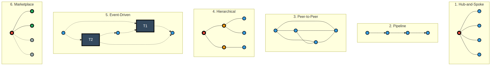

# Multi-Agent Architecture Patterns

Simple visual comparison of the 6 main patterns.



## Key Differences

### 1. Hub-and-Spoke ⭐ (Current System)
- **Big red center** = Controller
- **Blue nodes** = Agents
- All communication goes through controller
- **Best for:** 2-10 agents, simple coordination

### 2. Pipeline
- **Arrows show direction** of data flow
- Sequential processing A → B → C → D
- Each agent adds value in order
- **Best for:** Workflows, ETL, document processing

### 3. Peer-to-Peer
- **Every node connects to every other**
- No central controller
- Fully distributed, highly resilient
- **Best for:** High availability, distributed systems

### 4. Hierarchical
- **3 levels:** Red (root) → Orange (coordinators) → Blue (agents)
- Tree structure for scaling
- Domain separation
- **Best for:** 10+ agents, clear organizational domains

### 5. Event-Driven
- **Black boxes** = Event topics/channels
- **Dotted lines** = Publish/Subscribe
- Agents publish events, others subscribe
- **Best for:** Real-time, high throughput, microservices

### 6. Marketplace
- **Red center** = Broker/Auctioneer
- **Green nodes** = Selected agents (solid lines)
- **Gray nodes** = Available but not selected (dashed lines)
- Broker chooses best agents based on bids/capabilities
- **Best for:** Resource optimization, SLAs, cloud platforms

---

## Visual Legend

**Colors:**
- 🔴 **Red (thick border)** = Primary controller/broker
- 🟠 **Orange (medium border)** = Secondary coordinators
- 🔵 **Blue** = Regular agents
- 🟢 **Green** = Selected/active agents
- ⚫ **Gray** = Inactive/available agents
- ⬛ **Black boxes** = Infrastructure (topics, channels)

**Lines:**
- **Solid** = Active connection
- **Dashed** = Conditional/inactive
- **Arrow** = Directional flow
- **No arrow** = Bidirectional

---

## Quick Selection

```
Current system (2-5 agents)     → Hub-and-Spoke ✅
Need workflow stages            → Pipeline
Need high availability          → Peer-to-Peer
Have 10+ agents, domains        → Hierarchical
Need real-time events           → Event-Driven
Need resource optimization      → Marketplace
```

---

## Your System

**Pattern:** Hub-and-Spoke (#1)

**Why:**
- Simple coordination of Weather + Maps agents
- Clear control flow
- Easy to understand

**File:** `images/patterns_clear.png`
